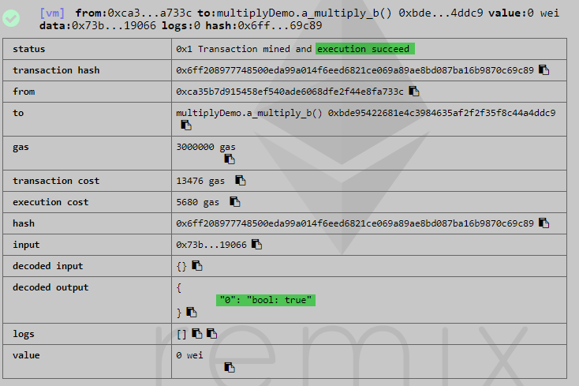

*******************
batchOverflow issue
*******************

Description
###########
This vulnerability took place in 22 April 2018 due to a well known and common issue in many programming languages. Some exchanges (like `OKEx <https://okex.com>`_, `Poloniex <https://poloniex.com/>`_, `HitBTC <https://hitbtc.com/>`_) stopped deposits and withdrawals of ALL ERC20 tokens, especially for `Beauty Ecosystem Coin (BEC) <https://etherscan.io/address/0xc5d105e63711398af9bbff092d4b6769c82f793d>`_ that was targeted by this exploit. In this attack, someone was able to run a `transaction <https://etherscan.io/tx/0xad89ff16fd1ebe3a0a7cf4ed282302c06626c1af33221ebe0d3a470aba4a660f>`_ and transfer two extremely large amount of BEC token to two addresses. Although BEC developpers had considered most of the security meseaurments, only one line of the code (line 257) was vulnerable against the classic integer overflow issue:

.. figure:: images/batch_overflow_04.png
    :align: center
    :figclass: align-center
    
    Figure 1: Vulnerable code in BEC token, batchTransfer() function

Attacker was able to pass input values that generate large results than the maximum value of ``uint256`` data type. As result of integer overflow, only the least significant bits would be retained and effectively causing `wrap around <https://en.wikipedia.org/wiki/Integer_overflow>`_. For example, an ``uint8`` can represent maximum value of ``(2^8)-1=255 (0xff)``. Multiplying ``0x02`` and ``0x80`` causes overflow and produces ``0x00`` as the result (0x80 * 0x02 = 0x100 => 0x00). We can acheive to the same result by adding ``0x01`` to ``0xff`` (0xff + 0x01 = 0x100 => 0x00). So, By passing two addresses (*_receivers.lengh* = 0x02) and a large value (*_value* = 0x8000000000000000000000000000000000000000000000000000000000000000(63 0's)), the result of *amount* variable was calculated as ``0x00`` and this result bypassed sanity checks in lines 259 and 261. Hence, it transfered the specified amount by *_value* to those two addresses.

In addition to BEC token, the following tokens are batchOverflow-affected [1]:

1. UgChain
2. SMART
3. MTC
4. FirstCoin
5. GG Token
6. CNY Token
7. MESH
8. SMT tokens

Reproducing the issue
#####################
The same logic is applicable in solidity programming language and we tested for ``uint256`` data type as shown below:

.. figure:: images/batch_overflow_01.png
    :align: center
    :figclass: align-center
    
    Figure 1: Integer overflow demonstration in solidity
    
We initially set ``c=0x3`` to check its result before and after addition operation performed by *a_plus_b_default()* function. On the left, we can see initial value of ``c`` before execution of the function and on the right, ``c`` has been set to zero due to wrap around.

.. figure:: images/batch_overflow_02.png
    :align: center
    :figclass: align-center
    
    Figure 2: Result of addition operation in case of integer overflow
    
Ethereum executes *a_plus_b_default()* function in unchecked context and shows successful status:

    
    Figure 3: By default, integer overflow does not throw a runtime exception in Ethereum

Although this is expected behaviour in Ethereum, it causes security problems as explained in `CVE-2018–10299 <https://nvd.nist.gov/vuln/detail/CVE-2018-10299>`_

Recommendation
##############
Recommendation is always use SafeMath library when performing any arithmetic calculations. This library offered by `OpenZeppelin <https://github.com/OpenZeppelin/zeppelin-solidity/blob/master/contracts/math/SafeMath.sol>`_ and becomes industry standard for catching overflows. Additionally, auditing before launching the code will helps to be in compliance with best practices.

.. [1] PeckShield, "New batchOverflow Bug in Multiple ERC20 Smart Contracts (CVE-2018–10299)," 22 4 2018. [Online]. Available: https://medium.com/@peckshield/alert-new-batchoverflow-bug-in-multiple-erc20-smart-contracts-cve-2018-10299-511067db6536 [Accessed 26 12 2018].

.. [2] M. Mulders, "Binance Hack Linked To Viacoin Pump (Official Update)," 7 3 2018. [Online]. Available: https://hackernoon.com/alleged-hack-of-binance-linked-to-viacoin-pump-bb9066bf96bf [Accessed 26 12 2018].
