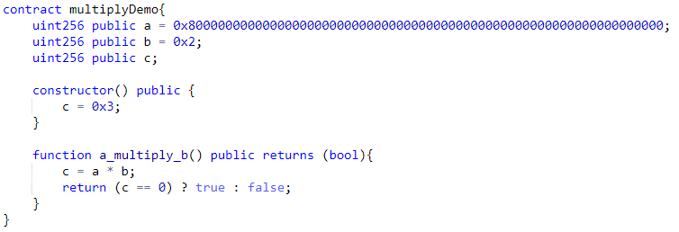
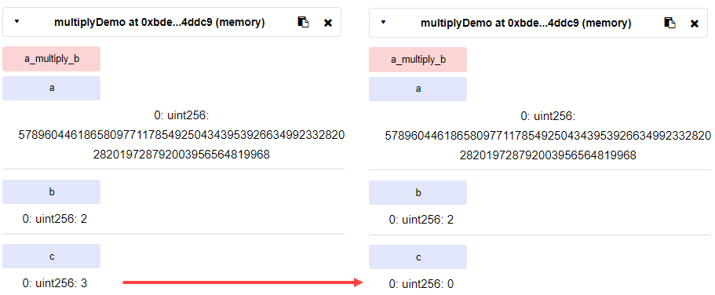

*******************
batchOverflow issue
*******************

Description
###########
This vulnerability took place in 22 April 2018 due to integer overflow exploit. Some exchanges (like `OKEx <https://www.okex.com>`_) stopped deposits and withdrawals of ALL ERC20 tokens, especially for `Beauty Ecosystem Coin (BEC) <https://etherscan.io/address/0xc5d105e63711398af9bbff092d4b6769c82f793d>`_ that was targeted by this exploit. Someone was able to transfer two extremely large amount of BEC token
In addition to BEC token, the following tokens have been affected [1]:
1. UgChain
2. SMART
3. MTC
4. FirstCoin
5. GG Token
6. CNY Token
7. MESH
8. SMT tokens
Although BEC developpers had implemented most of the security meseaurments, only line 257 of the code was vulnerable:
.. figure:: images/batch_overflow_04.png
    :align: center
    :figclass: align-center
    
    Figure 1: Vulnerable code in BEC token

Attacker was able to pass values larger than the maximum value that can be held by ``uint256`` data type. As result of integer overflow, only the least significant bits would be retained and effectively causing `wrap around <https://en.wikipedia.org/wiki/Integer_overflow>`_. For example, an ``uint8`` (8-bit unsigned integer) data type can represent maximum value of ``(2^8)-1=255 (0xff)``. Adding ``0x01`` causes overflow and produces ``0x00`` as the result (0xff + 0x01 = 0x100 => 0x00). 

Reproducing the issue
#####################
The same logic is applicable in solidity programming language and we tested for ``uint256`` data type as shown below:

    
    Figure 1: Integer overflow demonstration in solidity
    
We initially set ``c=0x3`` to check its result before and after addition operation performed by *a_plus_b_default()* function. On the left, we can see initial value of ``c`` before execution of the function and on the right, ``c`` has been set to zero due to wrap around.

    
    Figure 2: Result of addition operation in case of integer overflow
    
Ethereum executes *a_plus_b_default()* function in unchecked context and shows successful status:

.. figure:: images/batch_overflow_03.png
    :align: center
    :figclass: align-center
    
    Figure 3: By default, integer overflow does not throw a runtime exception in Ethereum

Although this is expected behaviour in Ethereum, it causes security problems as explained in `CVE-2018–10299 <https://nvd.nist.gov/vuln/detail/CVE-2018-10299>`_
Recommendation is always use SafeMath library offered by `OpenZeppelin <https://github.com/OpenZeppelin/zeppelin-solidity/blob/master/contracts/math/SafeMath.sol>`_. Additionally, auditing before launching the code will helps to be in compliance with best practices.

.. [1] PeckShield, "New batchOverflow Bug in Multiple ERC20 Smart Contracts (CVE-2018–10299)," 22 4 2018. [Online]. Available: https://medium.com/@peckshield/alert-new-batchoverflow-bug-in-multiple-erc20-smart-contracts-cve-2018-10299-511067db6536 [Accessed 26 12 2018].
