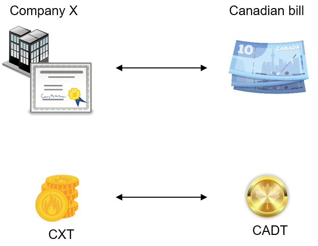

.. _erc20_intro

############
Introduction
############

ERC20 [#]_ in Ethereum [#]_ ecosystem is a standard that allows representing tangible assets as intangible instances. For example shares of company X can be represented as ERC20 token [#]_ to be tradable or re-used by other DApps [#]_. By using ERC20 tokens, we would be able to implement the left side of the following trading model:

    
    *Figure 1: A blockchain trading model using ERC20 tokens*

The right side of this trading model needs an intangible asset which is equivalent to a fiat currency (Like USD or CAD) [#]_. So, the value of it is stable over time and people be able to count on its value. Stablecoins provide such functionalities in blockchain by pegging to something that has a stable value (Like gold or USD). There would be three types of stablecoins :cite:`Ref09` that can be used in this trading model:

#. **Fiat-collateralized:** It will be backed by the equivalent fiat currency.
#. **Crypto-collateralized:** It uses other cryptocurrencies as collateral.
#. **Non-collateralized:** It is not backed by any collateral. It is similar to other fiat currencies that it is maintained by governments.

Representation of an stablecoin could be also through ERC20 standard. The only difference is that engaging parties of the exchange agreed on the value of the stablecoin (which is 1 CADT = 1 $CAD). By repressing share of company X and canadian dollar as ERC20 tokens, we would have two ERC20 tokens (with different values) to trade.

As originally mentioned, ERC20 tokens are standardized version of smart contracts with pre-defined API :cite:`Ref08`. Similar to other smart contracts, there are security vulnerabilities on them. Some of these vulnerabilities have been already discovered and handled by the Ethereum community. Here, we introduce a new solution to :ref:`multiple_withdrawal` by analyzing solutions that have been already discovered. Ultimately, the goal is to introduce a secure ERC20 code that could mitigate against identified/potential security vulnerabilities.

|
|
----

.. rubric:: Footnotes
.. [#] Technical standard used on the Ethereum blockchain for implementing tokens.
.. [#] Ethereum is a decentralized platform that runs distributed applications.
.. [#] A token can be considered as a virtual asset acts as currency that has value to trade.
.. [#] Distributed applications (DApps) run on blockchain and synchronize data through consensus mechanism.
.. [#] Fiat currency does not have underlying value. The value is because of government who maintains it.

|
|
----

.. rubric:: References
.. bibliography:: references.bib
    :style: plain

|
|
----

:Date:    Dec 24, 2018
:Updated: |today|
:Authors: :ref:`about`

