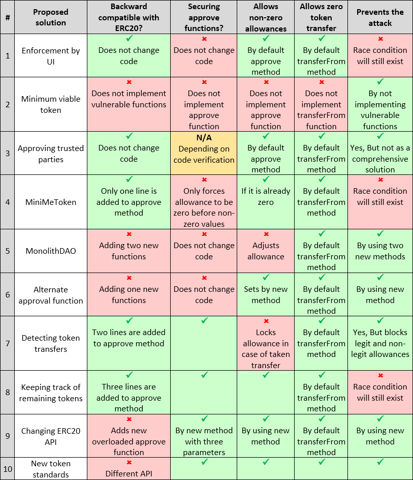
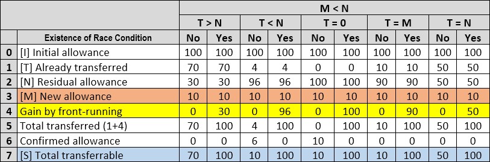
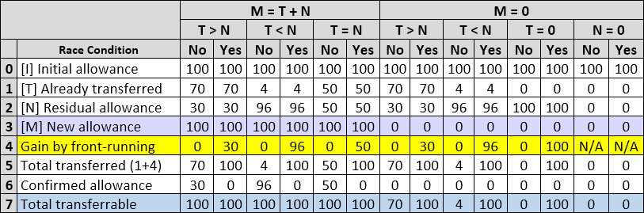

.. _multiple_withdrawal:

##########################
Multiple withdrawal attack
##########################

.. index:: ! Multiple withdrawal attack, double-spend exploit;

Description
***********
`ERC20 standard <https://github.com/ethereum/EIPs/blob/master/EIPS/eip-20.md>`_ defines required APIs [#]_ for approving and transferring tokens from an approver. By these APIs, tokens can be spent by another third party (e.g., approved spender, online exchanges, third-party payments, or quantitative fund managemer) on behalf of the owner. 

.. figure:: images/multiple_withdrawal_01.png
    :scale: 90%
    :figclass: align-center
    
    *Figure 1: approve and transferFrom methods as part of ERC20 API*

Two functions support this feature:

#. **approve**: It is a function which allows ``_spender`` to withdraw up to the ``_value`` amount of tokens from token pool of the approver. If this function is called again, it overwrites the current allowance with the new ``_value``.
#. **transferFrom**: It grants required rights to the spender (accounts, wallets or smart contracts) for transferring ``_value`` amount of tokens from address ``_from`` to address ``_to``.

As explain by :cite:`Ref03`, these two functions could be used in multiple withdrawal attack that allows a spender to transfer more tokens than the owner of tokens ever wanted. This is possible because ``approve`` method overrides current allowance regardless of whether spender already used it or not. Moreover, transferred tokens are not trackable and only ``Transfer`` event will be logged (which is not sufficient in case of transferring tokens to a third parity). Authors of ERC20 token standard, provided two sample implementations from `OpenZeppelin <https://github.com/OpenZeppelin/openzeppelin-solidity/blob/master/contracts/token/ERC20/ERC20.sol>`_ and `ConsenSys <https://github.com/ConsenSys/Tokens/blob/fdf687c69d998266a95f15216b1955a4965a0a6d/contracts/eip20/EIP20.sol>`_. *OpenZeppelin* implementation uses two additional methods that initially proposed by `MonolithDAO token <https://github.com/MonolithDAO/token/blob/master/src/Token.sol>`_ and *ConsenSys* has not attempted to work around the issue. There are other implementations that have different trade-offs. The issue is initially opened `here <https://github.com/ethereum/EIPs/issues/20#issuecomment-263524729>`_ and raised as separate thread `here <https://github.com/ethereum/EIPs/issues/738>`_:

    
    *Figure 2: Raised issue on Github from October 2017 (https://github.com/ethereum/EIPs/issues/738)*

This issue is still open since October 2017 and several suggestions have been made that needs to be evaluated in term of compatibly with the standard and mitigation against the attack. Here could be a possible attack scenario :cite:`Ref07`:

#. Alice allows Bob to transfer N tokens by calling ``approve(_BobAddr, N)``.
#. After a while, Alice decides to change approval from N to M by executing ``approve(_BobAddr, M)``.
#. Bob notices Alice's second transaction before it was mined and quickly sends another transaction that runs ``transferFrom(_AlicAddr, _BobAddr, N)``. This will transfer N Alice's tokens to Bob.
#. Bob's transaction will be executed before Alice's transaction (because of higher transaction fee, miner’s policy or other prioritization ways) and Bob front-runs Alice's transaction.
#. Alice’s transaction will be executed after Bob’s and allows Bob to transfer more M tokens.
#. Bob successfully transferred N Alice's tokens and gains ability of transferring another M tokens.
#. Before Alice notices that something went wrong, Bob calls ``transferFrom`` method again and transfers M Alice's tokens by executing ``transferFrom(_AlicAddr, _BobAddr, M)``.

In fact, Alice attempted to change Bob's allowance from N to M, but she made it possible for Bob to transfer N+M of her tokens at most, while Alice never wanted to allow so many transfers by Bob:

.. figure:: images/multiple_withdrawal_02.png
    :scale: 50%
    :figclass: align-center
    
    *Figure 3: Possible multiple withdrawal attack in ERC20 tokens*

The assumption here is to prevent Bob from withdrawing Alice’s tokens multiple times. If he could withdraw N tokens after the initial Alice’s approval, this would be considered as a legitimate transfer since Alice has already approved it (It is Alice’s responsibility to make sure before approving anything to Bob). In short, we are looking for a solution to prevent multiple withdrawal (N+M) by Bob assuming that Alice has more than N+M tokens in her wallet.

Suggested solutions
*******************
Several solutions have been suggested by Ethereum community (mostly from developers on GitHub) to address this attack. There would be some considerations for each solution that needs to be discussed in term of compatibility with ERC20 standard and attack mitigation. We have examined technical aspects of each solution below: 

.. _ui_enforcement:

1. Enforcement by User Interface (UI)
=====================================
As emphasized by ERC20 standard :cite:`Ref08`:

    
    *Figure 4: Recommendation of ERC20 standard to mitigate multiple withdrawal attack*

The standard recommends to set allowance to zero before any non-zero values and enforce approval processing check in UI instead of smart contract. But if Alice does not use UI and connects directly to the Blockchain, there would be a good chance of impacting by this attack. Furthermore, as discussed `here <https://github.com/OpenZeppelin/openzeppelin-solidity/issues/438#issuecomment-329172399>`_, this approach is not sufficient and still allows Bob to transfer N+M tokens:

#. Bob is allowed to transfer N Alice's tokens.
#. Alice publishes transaction that changes Bob's allowance to 0.
#. Bob front runs Alice's transaction and transfers N Alice's tokens (``transferFrom`` sets Bob’s allowance to 0).
#. Alice's transaction is mined and Bob's allowance is set to 0 by ``approve`` method. This is exactly what she would see if Bob would not transfer any tokens, so she has no reason to think that Bob actually used his allowance before it was revoked.
#. Now Alice publishes a new transaction that changes Bob's allowance to M.
#. Alice's second transaction is mined, Bob now is allowed to transfer M Alice's tokens.
#. Bob transfers M Alice's tokens and in total N+M.

At step 3, Bob is able to transfer N tokens and consequently his allowance becomes 0 (because of ``allowed[_from][msg.sender] = allowed[_from][msg.sender].sub(_tokens)``). This is a legitimate transaction since Alice has already approved it. The issue occurs after Alice’s new transaction (``approve(_BobAddr, 0)``). In case of front-running by Bob, Alice needs to check Bob’s allowance for the **second time** before setting any new value. However, she will find out Bob's allowance 0 in either case. In other words, she can not distinguish whether Bob's allowance is set to 0 because of her transaction (``approve(_BobAddr, 0)``) or Bob's one (``transferFrom(_AliceAddr, _BobAddr, _tokens)``).
Someone may point out that Alice notices this by checking ``Transfer`` event logged by ``transferFrom`` function. However, if Bob had transferred tokens to someone else (``transferFrom(_AliceAddr, _CarolAddr, _tokens)``), then ``Transfer`` event will not be linked to Bob, and, if Alice's account is busy and many people are allowed to transfer from it, Alice may not be able to distinguish this transfer from a legitimate one performed by someone else.
Overall, this solution does not prevent the attack while tries to follow ERC20 recommendations for setting Bob’s allowance to zero before any non-zero value. Hence, enforcement should be considered at contract level not UI level (Interestingly, *OpenZeppelin* example implements a workaround in contract level that makes it inconsistent with the text of ERC20). Additionally, There is no way to see from UI if ``approve(_BobAddr, 0)`` transaction is processed before the subsequent non-zero approval :cite:`Ref03`. This is because of current API in Web3.js [#]_ that does not support such checking :cite:`Ref04`.

2. Using minimum viable token
=============================
As suggested by :cite:`Ref05`, we can boil down ERC20 standard to a very basic functionalities by implementing only essential methods. this will prevent effecting of the attack by skipping implementation of vulnerable functions:

.. figure:: images/multiple_withdrawal_04.png
    :scale: 85%
    :figclass: align-center
    
    *Figure 5: Minimum viable ERC20 token implementation*

While removing ``approve`` and ``transferFrom`` functions prevent multiple withdrawal attack, it makes this token incompatible with ERC20 standards. According to ERC20 specifications, these methods are not OPTIONAL and must be implemented. Moreover, ignoring them will cause failed function calls by standard wallets that expect to interact with them. So, we would not consider this solution as a compatible fix although mitigates the attack.

3. Approving token transfer to verified smart contract or trusted third-party
==============================================================================
Approving token transfer to non-upgradable smart contracts can be considered safe. Because they do not contain any logic to take advantage of this vulnerability. For example, the below smart contract uses ``transferFrom`` function to transfer approved amount of tokens to someone who agreed to pay equivalent in Ether. So, it will be safe to allow token transfer by this smart contract:

.. figure:: images/multiple_withdrawal_05.png
    :scale: 100%
    :figclass: align-center
    
    *Figure 6: Verified code of a trusted smart contract before approving token transfers*

However, upgradable smart contracts may add new logic to a new version that needs re-verification before approving token transfer. Similarly, approving token transfer to people that we trust could be considered as a mitigation plan. Since this solution would have limited use cases, it could not be considered as a comprehensive solution for the attack.

.. _minimi_token:

4. MiniMeToken implementation
=============================
`MiniMeToken <https://github.com/Giveth/minime/blob/master/contracts/MiniMeToken.sol#L225>`_ also follows ERC20 recommendation by reducing allowance to zero before non-zero values. They added a line of code to the ``approve`` method. The red clause allows setting approval to 0 and blue condition checks allowance of ``_spender`` to be 0 before setting to other values (i.e., If ``_spender`` allowance is 0 then allows ``non-zero`` values):

    
    *Figure 7: MiniMeToken suggestion for adding new codes to approve method*

Similar to :ref:`ui_enforcement`, this will not prevent Bob from transferring N+M tokens. Because Alice would not be able to distinguish whether N tokens have been already transferred or not. It is more clear in this scenario:

#. Alice decides to set Bob's allowance to 0 (``approve(_BobAddr,0)``).
#. Bob front-runs Alice's transaction and his allowance sets to 0 after transferring N tokens (``allowed[_AliceAddr][_BobAddr] = allowed[_AliceAddr][_BobAddr].sub(N)``).
#. Alice's transaction is executed and sets Bob's allowance to 0 (Red clause passes sanity check).
#. Alice checks Bob's allowance and she will find it zero, so, she can not determine whether this was because of her transaction or Bob already transferred N tokens.
#. By considering that Bob has not been transferred any tokens, Alice allows Bob for transferring new M tokens.
#. Bob would be able to transfer new approved tokens.

.. _monolithDAO_token:

5. MonolithDAO Token
====================
`MonolithDAO Token <https://github.com/MonolithDAO/token/blob/master/src/Token.sol>`_ suggests two additional functions for increasing or decreasing allowance. ``approve`` function will also have an additional code to set allowance to zero before non-zero values:

    
    *Figure 8: Suggested approve and transferFrom methods by MonolithDAO*

    
    *Figure 9: New methods to increase/decrease the amount of approved tokens*

In this case, the default ``approve`` function should be called when spender’s allowance is zero (No approval has been made). If spender’s allowance is non-zero, Increase and decrease functions will be used:

    
    *Table 1: Functionality of approve method with new added code*

These two functions can address race condition and prevent allowance double-spend exploit:

#. Alice allows Bob to transfer N tokens by calling ``approve(_BobAddr, N)``. This will be executed by ``approve`` function since current Bob’s allowance is 0.
#. After a while, Alice decides to decrease Bob’s approval by M by running ``decreaseApproval(_BobAddr, M)``.
#. Bob notices Alice's second transaction and front runs it by executing ``transferFrom(_AlicAddr, _BobAddr, N)``.
#. Bob’s transaction will be executed first and transfers N token to his account and the his allowance becomes 0 as result of this transfer.
#. Alice’s transaction is mined after Bob’s transaction and tries to decrease Bob’s allowance by M. If Bob had already transferred more than M tokens, new Bob’s allowance becomes negative and it fails the transaction. So, the transaction does not change Bob's remaining allowance and he would be able to transfer the rest (which is legitimate transfer since Alice has already approved it). If Bob had transferred less than M tokens, the new allowance will be applied and reduces Bob's allowance by M.

Although these two new functions will prevent the attack, they have not been defined in the initial specifications of ERC20. So, they can not be used by smart contracts that are already deployed on the Ethereum network. Because they will still use ``approve`` method for setting new allowance and not ``increaseApproval`` or ``decreaseApproval``. Moreover, ERC20 specifications does not define any increase or decrease of allowance. It only defines new allowance. For example, if Alice has approved Bob for ``100`` tokens and wants to set it to ``80``, the new allowance should be ``80`` while using decrease methods will set it ``20 (100 - 80 = 20)``. Comparatively, increase method will set new allowance to ``180`` while it has to set to ``80`` again. For these reasons, this solution would not be compatible with ERC20 standard and only is usable if approver or smart contract are aware of these supplementary methods.

.. _alternate_approval_function:

6. Alternate approval function
==============================
`Another suggestion <https://github.com/kindads/erc20-token/blob/40d796627a2edd6387bdeb9df71a8209367a7ee9/contracts/zeppelin-solidity/contracts/token/StandardToken.sol>`_ is to move security checks to another function like ``safeApprove`` that sets allowance if it has not been already changed:

.. figure:: images/multiple_withdrawal_10.png
    :scale: 100%
    :figclass: align-center
    
    *Figure 11: safeApprove proposal as alternative to ERC20 standard approve function*

By using this function, Alice uses the standard ``approve`` function to set Bob’s allowance to 0 and for new approvals, she has to use ``safeApprove``. It takes the current expected approval amount as input parameter and calls ``approve`` method if previous allowance is equal to current expected approval. So, Alice will have one step more and it is reading the current allowance and passing it to the new ``safeApprove`` method. As mentioned in the last section, this approach is not backward compatible with already implemented smart contracts. The new ``safeApprove`` method that is not defined in ERC20 standard and existing code would not be able to use this safety feature.

7. Detecting token transfers
============================
In `this approach <https://gist.github.com/flygoing/2956f0d3b5e662a44b83b8e4bec6cca6>`_ a boolean variable is used to detect whether any tokens have been transferred or not. ``transferFrom`` method sets a flag to true if tokens are transferred. ``approve`` method checks the flag to be false before allowing new approvals (i.e., it checks if tokens have been used/transferred since the owner last allowance set). Moreover, it uses a new data structure (line 6) for keeping track of used/transferred tokens:

    
    *Figure 12: Using a boolean variable to keeping track of transfered tokens*
   
This approach could prevent race condition as described below:

#. Alice runs ``approve(_BobAddr, N)`` to allow Bob for transferring N tokens.
#. Since Bob's initial allowance is 0 and ``used`` flag is false, then sanity check passes and Bob's allowance is set to N.
#. Alice decides to set Bob's allowance to 0 by executing ``approve(_Bob, 0)``.
#. Bob front-runs Alice's transaction and transfers N tokens. Then, his ``used`` flag turns to true (line 31).
#. Alice's transaction is mined and passes sanity check in line 15 (because ``_value == 0``).
#. Bob's allowance is set to 0 (line 16) while ``used`` flag is still ``true``.
#. Alice changes Bob's allowance to M by executing ``approve(_BobAddr, M)``
#. Since Bob already transferred number of tokens, ``used`` flag is ``true`` and it fails the transaction.
#. Bob's allowance remains as N and he could transfer only N tokens.

Although this approach mitigates the attack, it prevents any further legitimate approvals as well. Considering a scenario that Alice rightfully wants to increase Bob's allowance from N to M (two non-zero values). If Bob had already transferred number of tokens (even 1 token), Alice would not be able to change his approval. Because ``used`` flag is true now (in line 31) and does not allow changing allowance to any non-zero values in line 15. Even setting the allowance to 0, does not flip ``used`` flag and keeps Bob's allowance locked down. In fact, the code needs a line like ``allowed[_from][msg.sender].used = false;`` between lines 16 and 17. But it will cause another problem. After setting allowance to 0, ``used`` flag becomes ``false`` and allows non-zero values event if tokens have been already transferred. In other words, it resembles the initial values of allowance similar when nothing is transferred. Therefore, it makes attack mitigation functionality ineffective. In short, this approach can not satisfy both legitimate and non-legitimate scenarios and violets ERC20 standard that says:

    
    *Figure 13: ERC20 approve method constraint*

Nevertheless, it is a step forward by introducing the need for a new variable to track transferred tokens.

8. Keeping track of remaining tokens
====================================
This `approach <https://github.com/ethereum/EIPs/issues/738#issuecomment-373935913>`_ is inspired by the previous one and keeping track of remaining tokens instead of detecting transferred tokens. It uses modified version of data structure that used in the previous solution for storing ``residual`` tokens:

    
    *Figure 14: Keeping track of remaining tokens*

At first, it seems that this solution is a sustainable way to mitigate the attack by setting apprval to zero before non-zero values. However, the highlighted code resembles the situation that we explained in :ref:`ui_enforcement`:

#. Bob's allowance is initially zero (``allowances[_AliceAddr][_BobAddr].initial=0``, ``allowances[msg.sender][spender].residual=0``).
#. Alice allows Bob to transfer N tokens (``allowances[_AliceAddr][_BobAddr].initial=N``, ``allowances[_AliceAddr][_BobAddr].residual=N``).
#. Alice decides to change Bob's allowance to M and has to set it to zero before any non-zero values.
#. Bob noticed Alice's transaction for setting his allowance to zero and transfers N tokens in advance. ``transferFrom`` sets his allowance (residual) to zero consequently (``allowances[_AliceAddr][_BobAddr].residual=0``).
#. Alice's transaction is mined and sets ``allowances[_AliceAddr][_BobAddr].initial=0`` and ``allowances[msg.sender][spender].residual=0`` (Similar to step 1). This is like that no token has been transferred. So, Alice would not be able to distinguish whether any token have been transferred or not.
#. Alice approves Bob for spending new M tokens.
#. Bob is able to transfer new M tokes in addition to initial N tokens.

Someone may think of using ``Transfer`` event to detect transferred tokens or checking approver balance to see any transferred tokens. As explained in :ref:`ui_enforcement`, using ``Transfer`` event is not sufficient in case of transferring tokens to a third party. Checking approver balance also would not be an accurate way if the contract is busy and there are lot of transfers. So, it would be difficult for the approver to detect legitimate from non-legitimate tokens transfers.

9. Changing ERC20 API
=====================
:cite:`Ref03` advised to change ERC20 ``approve`` method to compare current allowance of spender and sets it to new value if it has not already been transferred. This allows atomic compare and set of spender allowance to make the attack impossible. So, it will need new overloaded approve method with three parameters:

    
    *Figure 14: Suggested ERC20 API Change for approve method*
    
In order to use this new method, smart contracts have to update their codes to provide three parameters instead of current two, otherwise any ``approve`` call will throw an exception. Moreover, one more call is required to read current allowance value and pass it to the new ``approve`` method. New events need to be added to ERC20 specification to log an approval events with four arguments. For backward compatibility reasons, both three-arguments and new four-arguments events have to be logged. All of these changes makes this token contract incompatible with deployed smart contracts and software wallets. Hence, it could not be considered as viable solution.

10. New token standards
======================
After recognition of this security vulnerability, new standards like `ERC233 <https://github.com/Dexaran/ERC223-token-standard>`_ and `ERC721 <https://github.com/ethereum/EIPs/blob/master/EIPS/eip-721.md>`_ were introduced to address the issue in addition to improving current functionality of ERC20 standard. They changed approval model and fixed some drawbacks which need to be addressed in ERC20 as well (i.e., handle incoming transactions through a receiver contract, lost of funds in case of calling transfer instead of transferFrom, etc). Nevertheless, migration from ERC20 to ERC223/ERC721 would not be convenient and all deployed tokens needs to be redeployed. This also means update of any trading platform listing ERC20 tokens. The goal here is to find a backward compatible solution instead of changing current ERC20 standard or migrating tokens to new standards. Despite expanded features and improved security properties of new standards, we would not consider them as target solutions.

    
    *Figure 15: ERC271 token interface*
    
Comparing solutions
****************************
Analyzing suggested solutions indicate the following constraints to be satisfied for a sustainable solution:

#. Calling ``approve`` function has to overwrite current allowance with new allowance.
#. ``approve`` method does not adjust allowance, it sets new allowance.
#. Transferring 0 values by ``transferFrom`` method MUST be treated as normal transfers and fire the ``Transfer`` event.
#. Introducing new methods violates ERC20 specifications and it should be avoided for having compatible token with already deployed smart contracts.
#. Spender will be allowed to withdraw from approver account multiple times, up to the allowed amount.
#. Transferring initial allowed tokens is considered as legitimate transfer. It could happen right after approval or before changing it.
#. Race condition MUST not happen in any cases for preventing multiple withdrawal from approver account.

Comparing suggested solutions shows that they cannot satisfy at least one of the above constraints:

    
    *Table 2: Comparing suggested solutions*
    
Proposal 1
**********
As the comparison table shows, a new solution is required to address this security vulnerability while adhering specification of ERC20 standard. The standard advises approvers to change spender allowance from N to 0 and then from 0 to M (instead of changing it directly from N to M). Since there are gaps between transactions, it would be always a possibility of front-running. As discussed in :ref:`minimi_token` implementation, changing allowance to non-zero values after setting to zero, will require tracking of transferred tokens by the spender. If we can not track transferred tokens, we would not be able to identify if any token has been transferred between execution of transactions. Although It would be possible to track transferred token through ``Transfer`` events (logged by ``transferFrom``), it would not be easily trackable in case of transferring to a third-party (Alice -> Bob, Bob -> Carole => Alice -> Carole).

The only solution that removes this gap is to use compare and set (CAS) pattern :cite:`Ref06`. It is one of the most widely used lock-free synchronization strategy that allows comparing and setting values in an atomic way. It allows to compare values in one transaction and set new values before transferring control. To use this pattern and track transferred tokens, we would need to add a new mapping variable to our ERC20 token. This change will still keep the token code compatible with other smart contracts due to internal usage of the variable:

    
    *Figure 17: New added mapping variable to track transferred tokens*

Consequently, ``transferFrom`` method will have an new line of code for tracking transferred tokens by adding transferred tokens to ``transferred`` variable:

    
    *Figure 18: Modified version of transferFrom based on added mapping variable*

Similarly, a block of code will be added to approve function to compare new allowance with transferred tokens. It has to cover setting to zero and non-zero values:

    
    *Figure 19: Added code block to approve function to compare and set new allowance value*

Added code to ``Approve`` function will compare new allowance (``_tokens``) with current allowance of the spender (``allowed[msg.sender][_spender]``) and with already transferred token (``transferred[msg.sender][_spender]``). Then it decides to increase or decrease current allowance. If new allowance is less than initial allowance (sum of allowance and transferred), it denotes decreasing allowance, otherwise increasing allowance was intended. For example, we consider two below scenarios:

| 
| *1.	Alice approves Bob for spending 100 tokens and then decides to decrease it to 10 tokens.*
| 1.1.	Alice approves Bob for transferring 100 tokens.
| 1.2.	After a while, Alice decides to reduce Bob’s allowance from 100 to 10 tokens.
| 1.3.	Bob noticed Alice’s new transaction and transfers 100 tokens by front-running.
| 1.4.	Bob’s allowance is 0 and ``transferred`` is 100 (set by ``transferFrom`` function).
| 1.5.	Alice’s transaction is mined and checks initial allowance (100) with new allowance (10).
| 1.6.	As it is reducing, transferred tokens (100) will be compared with new allowance (10).
| 1.7.	Since Bob already transferred more tokens, his allowance will set to 0.
| 1.8.	Bob is not able to move more than initial approved tokens.
| 
| *2. Alice approves Bob for spending 100 tokens and then decides to increase to 120 tokens.*
| 2.1.	Alice approves Bob for transferring 100 tokens.
| 2.2.	After a while, Alice decides to increase Bob’s allowance from 100 to 120 tokens.
| 2.3.	Bob noticed Alice’s new transaction and transfers 100 tokens by front-running.
| 2.4.	Bob’s allowance is 0 and transferred is 100.
| 2.5.	Alice’s transaction is mined and checks initial allowance (100) with new allowance (120).
| 2.6.	As it is increasing, new allowance (120) will be subtracted from transferred tokens (100).
| 2.7.	20 tokens will be added to Bob’s allowance.
| 2.8.	Bob would be able to transfer more 20 tokens (120 in total as Alice wanted).
|

We can consider the below flowchart demonstrating how does Approve function works. By using this flowchart, all possible outputs could be generated based on tweaked inputs:

    
    *Figure 20: Flowchart of added code to Approve function*

In order to evaluate functionality of the new ``approve/transferFrom`` functions, we have implemented a standard ERC20 token along side our proposed ERC20 token:

https://rinkeby.etherscan.io/address/0x8825bac68a3f6939c296a40fc8078d18c2f66ac7

    
    *Figure 21: Standard ERC20 implementation on Rinkby test network*

https://rinkeby.etherscan.io/address/0xf2b34125223ee54dff48f71567d4b2a4a0c9858b

    
    *Figure 22: Proposed ERC20 implementation on Rinkby test network*
    
We have named these tokens as TKNv1 and TKNv2 representing standard and proposed ERC20 tokens. Code of each token has been added to the corresponding smart contract and verified by Etherscan. In order to make sure that this new implementation solves multiple withdrawal attack, several scenarios needs to be tested against it. We tested TKNv2 token with different inputs in two situations:

* Without considering race condition.
* By considering race condition (Highlighted in Yellow in the following tables)

It would be possible to get different results by tweaking three input parameters:

#. Number of already transferred tokens (T)
#. Current amount of allowed tokens to transfer (N)
#. New allowance for transferring tokens (M)

By changing these parameters, we would be able to evaluate all possible results based on different inputs. These results have been summarized in Tables 3, 4, 5. For example, Table2 shows result of all possible input values if approver wants to reduce previously allowed transfers. Table 3 evaluates the same result for increasing and even passing the same allowance as before. the last table checks input values in boundaries (New allowance = 0 OR New allowance = Current allowance + Transferred tokens).

    
    *Table 3: Test results in case on new allowance (M) < current allowance (N)*

    
    *Table 4: Test results in case on new allowance (M) > current allowance (N) OR new allowance (M) = current allowance (N)*

    
    *Table 5: Test results in case on new allowance (M) = 0 OR new allowance (M) = Transferred tokens (T) + current allowance (N)*

In Table 2, the goal is to prevent spender from transferring more tokens than already transferred. Because approver is reducing allowance, so the result (Total transferable = S) MUST be always in range of M≤ S≤T+N. As we can see this equation is true for all results of Table1 which is showing this attack is not possible in case of reducing allowance. In Table 4 and Table 5, total transferable tokens MUST be always less than new allowance (S≤M) no matter how many tokens have been already transferred. Result of tests for different input values shows that *TKNv2* can address multiple withdrawal attack by making front-running gain ineffective. Moreover, we compared these two tokens in term of Gas consumption. TokenV2.approve uses almost the same Gas as ``TokenV1.approve``, however, gas consumption of ``TokenV2.transferFrom`` is around 50% more than ``TokenV1.transferFrom``. This difference is because of maintaining a new mapping variable for tracking transferred tokens:

    
    *Table 6: comparison of Gas consumption between TKNv1 and TKNv2*

Additionally, Transferring and receiving tokens trigger expected events (Visible under Etherscan): 

    
    *Figure 23: Logged event by TKNv2 after calling Approve or transferFrom*

In term of compatibly, working with current wallets (Like MetaMask) shows no transfer issue:

    
    *Figure 24: Compatibility of the token with current wallets*

Proposal 2
**********
Proposal 1 mitigates the attack in all situations, however it adjusts allowance based on transferred tokens. For example, if Alice allowed Bob for transferring 100 tokens and she deccides to increase it to 120 tokens, the allowance will not directly set to 120 and the code adjusts it as below:

#. If Bob already transferred 100 tokens, the new allowance will be 20 (100+20 = 120).
#. If Bob already transferred 70 tokens, the new allowance will be 50 (70+50 = 120).
#. If Bob has not already transferred any tokens, the new allowance will be 120 (0+120=120).

Although the final result will be the same and does not allow Bob to transfer more than intended tokens, But ERC20 standard approve mehtod emphasizes that:

    
    *Figure 25: ERC20 approve method constraint*

Hence, adjusting allowance will violate this constraint of ERC20 standard. Since this was our last solution for improving ``approve`` method, we would assume API change as final suggestion for makeing ``approve`` method safer. It seems that there is no implementation to satisfy the standard constraints and mitigating against the attack under one solution. Hence, security of ``transferFrom`` method could be improved as an alternative solution. ERC20 standard emphasizes that:

    
    *Figure 25: ERC20 transferFrom method constraint*

So, the goal is to prevent spender from transferring more tokens than allowed by the approve. Based on this impression, we should not consider allowance as the main factor. Transferred tokens should be considered as the main variable in calculations. For example:

#. Alice allowed Bob for transferring 100 tokens and decides to set it to 70 after a while.
#. Bob front runs Alice's transaction and transfers 100 tokes (Legit transfer)
#. Alice's transaction is mined and sets Bob allowance to 80.
#. Bob got new allowance and runs ``transferFrom(_BobAddr,80)``. Since he already transfered more than 80, his trasanction will fail and prevent multiple withdrawal.
#. Bob'a allowance stays as 80, however, he can not use it.

So, here allowance can be considered as **possible allowance** or **potential allowance**. It indicates that Bob is elligible to transfer up to allowance limit if he has not already transferred anytokens. So, by this assumption, we can secure ``transferFrom`` method instead of ``approve`` method:

.. figure:: images/multiple_withdrawal_31.png
    :scale: 100%
    :figclass: align-center
    
    *Figure 26: Securing transferFrom method instead of approve method*
    
https://rinkeby.etherscan.io/address/0x55b9871e66976cb4263c13a9c9e250e31a880b8f

    
    *Figure 27: Proposed ERC20 implementation on Rinkby test network*

Conclusion
**********
Based on ERC20 specifications, token owners should be aware of their approval consequences. If they approve someone to transfer N tokens, spender can transfer exactly N tokens, even if they change allowance to zero afterward. This is considered a legitimate transaction and responsibility of approver before allowing the spender to transfer tokens. An attack can happen when changing allowance from N to M, that allows spender to transfer N+M tokens and effect multiple withdrawal attack. This attack is possible in case of front-running by approved side. As we evaluated possible solutions, all approaches violate ERC20 specifications or have not addressed the attack completely. Proposal 1 uses CAS pattern for checking and setting new allowance atomically. In proposal 2, transfer function is secured instead of approve method. We implemented an ERC20 token for each proposal that solve this security issue while keeping backward compatibly with already deployed smart contracts or wallets. Although these implementations consumes more Gas than standard ERC20 implementation, they are secure and could be considered for future ERC20 token deployment.

|
|
|

.. rubric:: Footnotes
.. [#] Advanced Programming Interface (API) defines components of an application in terms of inputs, outputs and operations. It provides a standard interface for other applications to interact with our application.
.. [#] `JavaScript UI library <https://github.com/ethereum/wiki/wiki/JavaScript-API>`_ for interacting with Ethereum blockchain.

|
|
|

----

.. rubric:: References
.. bibliography:: references.bib
    :style: plain

|
|
|

----

:Date:    Dec 25, 2018
:Updated: |today|
:Authors: :ref:`about`
