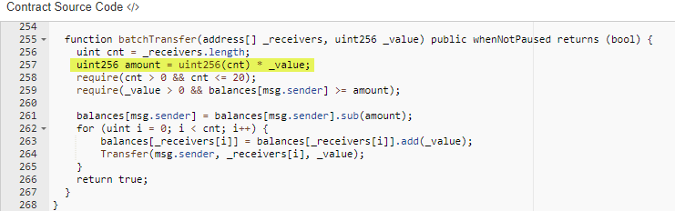
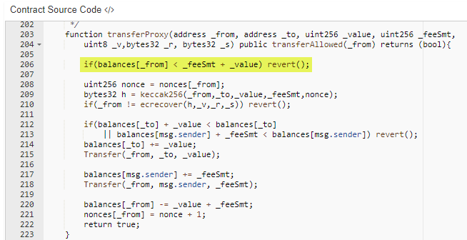
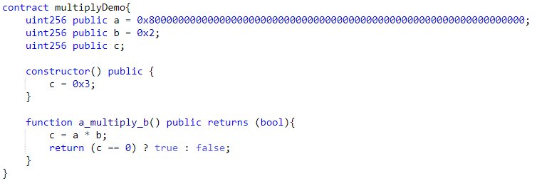
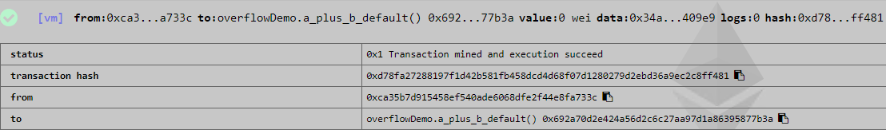
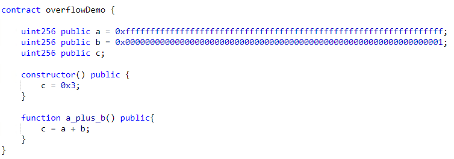
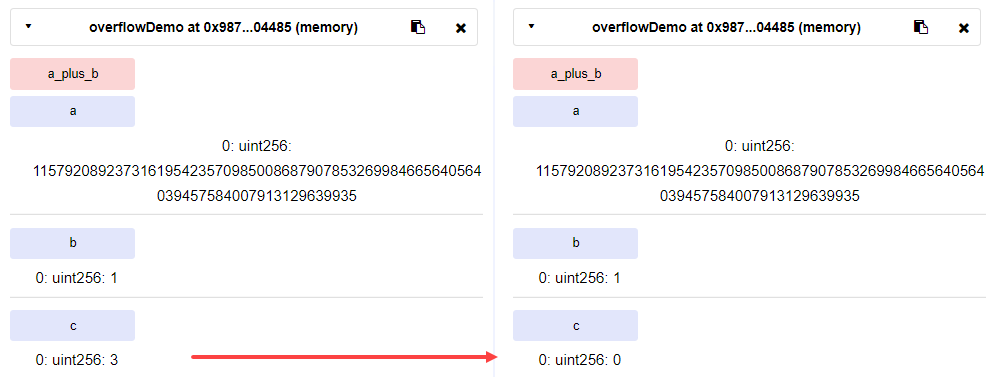

*******************
Overflow attack
*******************

----

Description
###########
This vulnerability took place in April 22, 2018 due to a well known and common issue in many programming languages called `Integer overflow <https://en.wikipedia.org/wiki/Integer_overflow>`_. It termed as **batchOverflow** or **proxyOverflow** and some exchanges (like `OKEx <https://okex.com>`_, `Poloniex <https://poloniex.com/>`_, `HitBTC <https://hitbtc.com/>`_ and `Huobi Pro <https://www.huobi.com/en-us/>`_) stopped deposits and withdrawals of ALL ERC20 tokens, especially for `Beauty Ecosystem Coin (BEC) <https://etherscan.io/address/0xc5d105e63711398af9bbff092d4b6769c82f793d>`_ that was targeted by this exploit. In this attack, someone was able to run a `transaction <https://etherscan.io/tx/0xad89ff16fd1ebe3a0a7cf4ed282302c06626c1af33221ebe0d3a470aba4a660f>`_ and transfer two extremely large amount of BEC token to two addresses. Although BEC developers had considered most of the security measurements, only one line of the code (line 257) was vulnerable against this classic integer overflow issue :cite:`PeckShield01`

    
    Figure 1: Vulnerable code in BEC token, batchTransfer() function

Attacker was able to pass a combination of input values that generate large results than the maximum value of ``uint256`` data type. It caused integer overflow and only the least significant bits have been retained. In other words, the integer variable reached to the maximum value that can be held and it `wraps around <https://en.wikipedia.org/wiki/Integer_overflow>`_ by starting from 0. For example, a ``uint8`` variable can represent maximum value of ``(2^8)-1=255 (0xff)``. Multiplying ``0x02`` by ``0x80`` causes integer overflow and produces ``0x00`` as the result (``0x80 * 0x02 = 0x100 => 0x00``). We can achieve the same result by adding ``0x01`` to ``0xff`` (``0xff + 0x01 = 0x100 => 0x00``). So, attacker passed two addresses ( *_receivers.lengh* = ``0x02`` ) and a large value ( *_value* = ``0x8000000000000000000000000000000000000000000000000000000000000000 (63 0's)`` ) to *batchTransfer()* function, the result of *amount* variable was calculated as ``0x00`` and this result bypassed sanity checks in line 259. Hence, it transferred the specified amount by *_value* to those two addresses. This transfer was even more than ``7000000000000000000000000000 (27 0's)`` initial supply of the token.

`Smart Mesh (SMT) <https://etherscan.io/address/0x55f93985431fc9304077687a35a1ba103dc1e081>`_ token was the next victime on April 24, 2018 by `transfering <https://etherscan.io/tx/0x1abab4c8db9a30e703114528e31dee129a3a758f7f8abc3b6494aad3d304e43f>`_ ``0x8fffffffffffffffffffffffffffffffffffffffffffffffffffffffffffffff (63 f’s)`` tokens to `one address <https://etherscan.io/token/0x55f93985431fc9304077687a35a1ba103dc1e081?a=0xdf31a499a5a8358b74564f1e2214b31bb34eb46f>`_ and ``0x7000000000000000000000000000000000000000000000000000000000000001 (62 0's)`` as huge fee to the transaction `initiator <https://etherscan.io/address/0xd6a09bdb29e1eafa92a30373c44b09e2e2e0651e>`_. An attacker called *proxyOverflow()* function which was designed for transfering token on behalf on someone else by taking a fee. Line 206 of this smart contract was vulnerable to the exploit:

    
    Figure 2: Vulnerable code in SMT token, proxyTransfer() function

In addition to BEC and SMT, the following tokens are Overflow-affected :cite:`PeckShield02`:

#. `MESH <https://etherscan.io/address/0x3ac6cb00f5a44712022a51fbace4c7497f56ee31>`_
#. `UGToken <https://etherscan.io/address/0x43ee79e379e7b78d871100ed696e803e7893b644>`_
#. `SMART <https://etherscan.io/address/0x60be37dacb94748a12208a7ff298f6112365e31f>`_
#. `MTC <https://etherscan.io/address/0x8febf7551eea6ce499f96537ae0e2075c5a7301a>`_
#. `First <https://etherscan.io/address/0x9e88770da20ebea0df87ad874c2f5cf8ab92f605>`_
#. `GG Token <https://etherscan.io/address/0xf20b76ed9d5467fdcdc1444455e303257d2827c7>`_
#. `CNY Token <https://etherscan.io/address/0x041b3eb05560ba2670def3cc5eec2aeef8e5d14b>`_
#. `CNYTokenPLus <https://etherscan.io/address/0xfbb7b2295ab9f987a9f7bd5ba6c9de8ee762deb8>`_

Reproducing the issue
#####################
The same logic is applicable in solidity programming language and we tested for ``uint256`` data type as shown below:

    
    Figure 3: Integer overflow demonstration in solidity
    
We initially set ``c=0x3`` to check its result before and after multiplication operation performed by *a_multiply_b()* function. On the left, we can see initial value of ``c`` before execution of the function and on the right, ``c`` has been set to zero due to wrap around.

.. figure:: images/batch_overflow_02.png
    :align: center
    :figclass: align-center
    
    Figure 4: Result of multiplication operation in case of integer overflow
    
Ethereum executes *a_multiply_b()* function in unchecked context and shows successful status by returning ``true`` as output:

    
    Figure 5: By default, integer overflow does not throw a runtime exception in Ethereum

The same overflow result can be achieved in addition as well: 

    
    Figure 6: Integer overflow demonstration in solidity

    
    Figure 7: Result of addition operation in case of integer overflow

Although this is expected behavior in Ethereum, it causes security problems as explained in `CVE-2018–10299 <https://nvd.nist.gov/vuln/detail/CVE-2018-10299>`_ and `CVE-2018-10376 <https://nvd.nist.gov/vuln/detail/CVE-2018-10376>`_

Recommendation
##############
Recommendation is always use SafeMath library when performing any arithmetic calculations. This library offered by `OpenZeppelin <https://github.com/OpenZeppelin/zeppelin-solidity/blob/master/contracts/math/SafeMath.sol>`_ and becomes industry standard for catching overflows. Additionally, auditing before launching the code could prevent such human errors and help to be in compliance with best practices.

.. rubric:: References

.. bibliography:: references.bib
    :style: plain
    
----

:Authors: Reza RAHIMIAN
:Version: 30-Dec-2018
