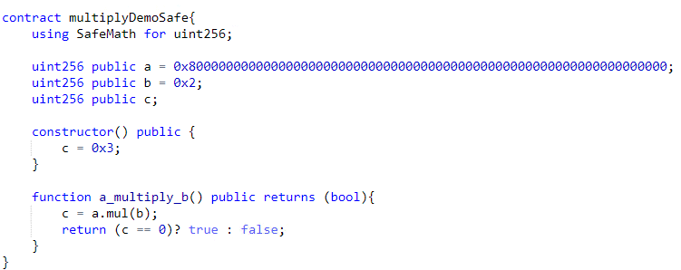
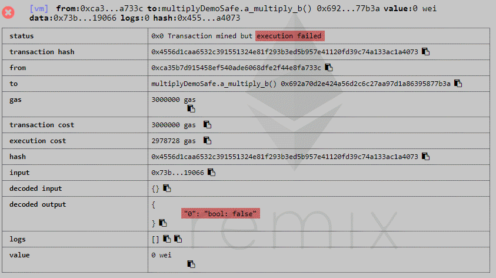

.. _overflow_attack:

###############
Overflow attack
###############

.. index:: ! overflow attack, batchOverflow attack, proxyOverflow attack;
    
Description
***********
This attack took place in April 22, 2018 due to a well known and common issue in many programming languages called `Integer overflow <https://en.wikipedia.org/wiki/Integer_overflow>`_. It termed as **batchOverflow** or **proxyOverflow** and some exchanges (like `OKEx <https://okex.com>`_, `Poloniex <https://poloniex.com/>`_, `HitBTC <https://hitbtc.com/>`_ and `Huobi Pro <https://www.huobi.com/en-us/>`_) stopped deposits and withdrawals of ALL ERC20 tokens, especially for `Beauty Ecosystem Coin (BEC) <https://etherscan.io/address/0xc5d105e63711398af9bbff092d4b6769c82f793d>`_ that was targeted by this exploit. In this attack, someone was able to run a `transaction <https://etherscan.io/tx/0xad89ff16fd1ebe3a0a7cf4ed282302c06626c1af33221ebe0d3a470aba4a660f>`_ and transfer two extremely large amount of BEC token to two addresses. Although BEC developers had considered most of the security measurements, only one line of the code (line 257) was vulnerable against this classic integer overflow issue :cite:`PeckShield01`:

.. figure:: images/batch_overflow_04.png
    :figclass: align-center
    
    Figure 1: Vulnerable code in BEC token, batchTransfer() function

Attacker was able to pass a combination of input values that generate large results than the maximum value of ``uint256`` data type could hold. It caused integer overflow and only the least significant bits have been retained. In other words, the ``uint256`` variable reached to the maximum value that can be held and it `wraps around <https://en.wikipedia.org/wiki/Integer_overflow>`_ by starting from 0. For example, an ``uint8`` (8-bit unsigned integer) variable can represent maximum value of :math:`2^8-1=255` ``(0xff)``. Multiplying ``0x02`` by ``0x80`` causes integer overflow and produces ``0x00`` as the result (``0x02 * 0x80 = 0x100 => 0x00``). We can achieve the same result by adding ``0x01`` to ``0xff`` (``0x01 + 0xff = 0x100 => 0x00``). So, In BEC case, attacker passed two addresses ( *cnt = _receivers.lengh* = ``0x02`` ) and a large value ( *_value* = ``0x8000000000000000000000000000000000000000000000000000000000000000 (63 0's)`` ) to *batchTransfer()* function. Because of wrap around, the result of *amount* variable (line 257) was calculated as ``0x00`` and this result bypassed sanity checks in line 259. Hence, line 264 transferred the specified *_value* to those two addresses. This transfer was even more than the initial supply of the token (``7000000000000000000000000000 (27 0's)``) and allowed attacker to take control of token finance.

`Smart Mesh (SMT) <https://etherscan.io/address/0x55f93985431fc9304077687a35a1ba103dc1e081>`_ token was the next victime of this exploit on April 24, 2018 by `transfering <https://etherscan.io/tx/0x1abab4c8db9a30e703114528e31dee129a3a758f7f8abc3b6494aad3d304e43f>`_ ``0x8fffffffffffffffffffffffffffffffffffffffffffffffffffffffffffffff (63 f’s)`` tokens to `one address <https://etherscan.io/token/0x55f93985431fc9304077687a35a1ba103dc1e081?a=0xdf31a499a5a8358b74564f1e2214b31bb34eb46f>`_ and ``0x7000000000000000000000000000000000000000000000000000000000000001 (62 0's)`` as huge fee to the transaction `initiator <https://etherscan.io/address/0xd6a09bdb29e1eafa92a30373c44b09e2e2e0651e>`_. An attacker called *proxyOverflow()* function which was designed for transfering tokens on behalf on someone else by taking a fee. Line 206 of this smart contract was vulnerable and sum of *_feeSmt and _value* bypassed the sanity check in line 206:

.. figure:: images/batch_overflow_05.png
    :figclass: align-center
    
    Figure 2: Vulnerable code in SMT token, proxyTransfer() function

In addition to BEC and SMT, the following tokens have been identified as overflow-affected :cite:`PeckShield02`:

#. `MESH <https://etherscan.io/address/0x3ac6cb00f5a44712022a51fbace4c7497f56ee31>`_
#. `UGToken <https://etherscan.io/address/0x43ee79e379e7b78d871100ed696e803e7893b644>`_
#. `SMART <https://etherscan.io/address/0x60be37dacb94748a12208a7ff298f6112365e31f>`_
#. `MTC <https://etherscan.io/address/0x8febf7551eea6ce499f96537ae0e2075c5a7301a>`_
#. `First <https://etherscan.io/address/0x9e88770da20ebea0df87ad874c2f5cf8ab92f605>`_
#. `GG Token <https://etherscan.io/address/0xf20b76ed9d5467fdcdc1444455e303257d2827c7>`_
#. `CNY Token <https://etherscan.io/address/0x041b3eb05560ba2670def3cc5eec2aeef8e5d14b>`_
#. `CNYTokenPLus <https://etherscan.io/address/0xfbb7b2295ab9f987a9f7bd5ba6c9de8ee762deb8>`_

Reproducing the issue
*********************
To check feasibility of this attack in the current version of solidity programming language (``0.5.2`` as writing this), the below smart contract is created and used to test overflow attack on ``uint256`` data type:

.. figure:: images/batch_overflow_01.png
    :figclass: align-center
    
    Figure 3: Integer overflow demonstration in solidity
    
We initially set ``c=0x3`` to check its result before and after multiplication operation performed by *a_multiply_b()* function. On the left, we can see initial value of ``c=3`` before execution of the function and on the right, after that. Value of ``c`` has been set to zero after execution of the function due to wrap around.

.. figure:: images/batch_overflow_02.png
    :figclass: align-center
    
    Figure 4: Result of multiplication operation in case of integer overflow
    
Ethereum executed *a_multiply_b()* function in unchecked context and showed successful status by returning ``true`` as output of the function:

.. figure:: images/batch_overflow_03.png
    :figclass: align-center
    
    Figure 5: By default, integer overflow does not throw a runtime exception in Ethereum

The same overflow result can be reprocuded in the sum of two ``uint256`` numbers: 

.. figure:: images/batch_overflow_06.png
    :figclass: align-center
    
    Figure 6: Integer overflow demonstration in solidity

.. figure:: images/batch_overflow_07.png
    :figclass: align-center
    
    Figure 7: Result of addition operation in case of integer overflow

As shown above, the arithmetic result of numeric values outside of the representable range will lead to wrap around and sets the result to 0. Although this is expected behavior in Ethereum, it causes security problems as explained in `CVE-2018–10299 <https://nvd.nist.gov/vuln/detail/CVE-2018-10299>`_ and `CVE-2018-10376 <https://nvd.nist.gov/vuln/detail/CVE-2018-10376>`_. To address this issue, there are best practices to follow as explained in the next section.

Mitigation
**********
To prevent overflow attack, it is recommended to use `SafeMath <https://github.com/OpenZeppelin/zeppelin-solidity/blob/master/contracts/math/SafeMath.sol>`_ library when performing any arithmetic calculations. This library offered by `OpenZeppelin <https://github.com/OpenZeppelin/openzeppelin-solidity>`_ and becomes industry standard for catching overflows. Additionally, auditing before launching the code could prevent such human errors and help to be in compliance with best practices. We used SafeMath library and re-implemented vulnerable functions in the previous section:

    
    Figure 8: Re-implemented multiply function by using SafeMath library

This time, execution of *a_multiply_b()* function raised an exception and stopped code execution:

    
    Figure 9: Raised exception in case of overflow issue
    
Full Code:

.. code-block:: java
    :emphasize-lines: 137, 154
    :linenos:

    pragma solidity ^0.5.2;

    /**
     * @title SafeMath
     * @dev Math operations with safety checks that revert on error
     */
    library SafeMath {
        int256 constant private INT256_MIN = -2**255;

        /**
        * @dev Multiplies two unsigned integers, reverts on overflow.
        */
        function mul(uint256 a, uint256 b) internal pure returns (uint256) {
            // Gas optimization: this is cheaper than requiring 'a' not being zero, but the
            // benefit is lost if 'b' is also tested.
            // See: https://github.com/OpenZeppelin/openzeppelin-solidity/pull/522
            if (a == 0) {
                return 0;
            }

            uint256 c = a * b;
            require(c / a == b);

            return c;
        }

        /**
        * @dev Multiplies two signed integers, reverts on overflow.
        */
        function mul(int256 a, int256 b) internal pure returns (int256) {
            // Gas optimization: this is cheaper than requiring 'a' not being zero, but the
            // benefit is lost if 'b' is also tested.
            // See: https://github.com/OpenZeppelin/openzeppelin-solidity/pull/522
            if (a == 0) {
                return 0;
            }

            require(!(a == -1 && b == INT256_MIN)); // This is the only case of overflow not detected by the check below

            int256 c = a * b;
            require(c / a == b);

            return c;
        }

        /**
        * @dev Integer division of two unsigned integers truncating the quotient, reverts on division by zero.
        */
        function div(uint256 a, uint256 b) internal pure returns (uint256) {
            // Solidity only automatically asserts when dividing by 0
            require(b > 0);
            uint256 c = a / b;
            // assert(a == b * c + a % b); // There is no case in which this doesn't hold

            return c;
        }

        /**
        * @dev Integer division of two signed integers truncating the quotient, reverts on division by zero.
        */
        function div(int256 a, int256 b) internal pure returns (int256) {
            require(b != 0); // Solidity only automatically asserts when dividing by 0
            require(!(b == -1 && a == INT256_MIN)); // This is the only case of overflow

            int256 c = a / b;

            return c;
        }

        /**
        * @dev Subtracts two unsigned integers, reverts on overflow (i.e. if subtrahend is greater than minuend).
        */
        function sub(uint256 a, uint256 b) internal pure returns (uint256) {
            require(b <= a);
            uint256 c = a - b;

            return c;
        }

        /**
        * @dev Subtracts two signed integers, reverts on overflow.
        */
        function sub(int256 a, int256 b) internal pure returns (int256) {
            int256 c = a - b;
            require((b >= 0 && c <= a) || (b < 0 && c > a));

            return c;
        }

        /**
        * @dev Adds two unsigned integers, reverts on overflow.
        */
        function add(uint256 a, uint256 b) internal pure returns (uint256) {
            uint256 c = a + b;
            require(c >= a);

            return c;
        }

        /**
        * @dev Adds two signed integers, reverts on overflow.
        */
        function add(int256 a, int256 b) internal pure returns (int256) {
            int256 c = a + b;
            require((b >= 0 && c >= a) || (b < 0 && c < a));

            return c;
        }

        /**
        * @dev Divides two unsigned integers and returns the remainder (unsigned integer modulo),
        * reverts when dividing by zero.
        */
        function mod(uint256 a, uint256 b) internal pure returns (uint256) {
            require(b != 0);
            return a % b;
        }
    }

    /**
     * @title multiplyDemoSafe
     * @dev Use SafeMath to prevent overflow attack
     */
    contract multiplyDemoSafe {
        using SafeMath for uint256;

        uint256 public a = 0x8000000000000000000000000000000000000000000000000000000000000000;
        uint256 public b = 0x2;
        uint256 public c;

        constructor() public {
            c = 0x3;
        }

        function a_multiply_b() public returns (bool){
            c = a.mul(b);
            return (c == 0) ? true : false;
        }    
    }
    
    contract additionDemoSafe {
        using SafeMath for uint256;

        uint256 public a = 0xffffffffffffffffffffffffffffffffffffffffffffffffffffffffffffffff;
        uint256 public b = 0x0000000000000000000000000000000000000000000000000000000000000001;
        uint256 public c;

        constructor() public {
            c = 0x3;
        }

        function a_plus_b() public returns (bool){
            c = a.add(b);
            return (c == 0) ? true : false;
        }
    } 

Conclusion
**********
In order to have a safe solidity code, it is recoomended to use `SafeMath <https://github.com/OpenZeppelin/openzeppelin-solidity/blob/master/contracts/math/SafeMath.sol>`_ library in any arithmetic operation.

::

----

.. rubric:: References
.. bibliography:: references.bib
    :style: plain

----

:Date:    2018-12-26
:Updated: 2019-01-02
:Version: 1.0
:Authors: :ref:`about`
